# گزارش QA بصری پیش از انتشار — موبایل و دسکتاپ

**تاریخ:** ۵ مهر ۱۴۰۵ · **کد بررسی‌شده:** کامیت `9b3f296` (همان نسخه‌ی برنچ اصلی `claude/phase-2-skeleton-m9zuaa`)

## روش کار

- **بیلد:** بیلد واقعی production (`opennextjs-cloudflare build` و `preview`)، نه `next dev`.
- **ابزار:** Chromium از طریق Playwright.
- **صفحه‌ها:** ۱۰ صفحه، هر کدام در ۲ زبان و ۲ اندازه:
  - `/` ، `/collections` ، `/collections/first-harvest` ، `/products/athena` ، `/about` ، `/contact` ، `/order` ، `/terms` و یک آدرس ناموجود (404).
  - موبایل: ۳۷۵×۸۱۲ · دسکتاپ: ۱۴۴۰×۹۰۰
- **حالت‌های فرم سفارش:** خطا (ارسال خالی)، انتخاب تلگرام، و پیام موفقیت.
- **جمع اسکرین‌شات‌ها:** ۴۸ تصویر.
- **داده‌ها:** متن‌ها همان داده‌ی واقعی production هستند که به‌صورت فقط‌خواندنی از D1 خوانده شد: ۳ کالکشن، ۱۱ محصول، توضیحات، قیمت‌ها و نقطه‌ی فوکوس عکس‌ها. این داده‌ها در یک کپی محلی جدا بارگذاری شد و دیتابیس تست‌ها دست نخورد.
- **⚠️ عکس‌ها:** عکس‌های واقعی در KV سایت زنده‌اند و از این محیط در دسترس نیستند. به جای آن‌ها ۹ عکس `public/photos` روی همان محصولات گذاشته شد. پس برش عکس‌های واقعی (مثلاً اینکه صورت مدل در کارت محصول بریده می‌شود یا نه) در این گزارش قضاوت نشده است.
- **اسکرین‌شات‌های تمام‌صفحه:** صفحه صفحه‌به‌صفحه اسکرول و عکاسی شده و قاب‌ها به هم چسبانده شده‌اند. پس هر بخش دقیقاً همان‌طور دیده می‌شود که بازدیدکننده هنگام اسکرول می‌بیند. رنگ پس‌زمینه‌ی صفحه‌ی اصلی به اسکرول وابسته است و اسکرین‌شات معمولی آن را اشتباه نشان می‌داد. هدر ثابت فقط در قاب اول آمده است.
- **بررسی خودکار:** هر صفحه با اسکریپت هم بررسی شد. نتیجه در `audit.json` است:
  - هیچ اسکرول افقی، عکس خراب یا خطای جاوااسکریپتی پیدا نشد.
  - تنها خطای کنسول، بارگذاری نشدن اسکریپت آمار Cloudflare است. این به خاطر بسته بودن شبکه در این محیط است، نه باگ سایت.

> **نکته درباره‌ی بریف:** بریف فرم سفارش را در `/contact` فرض کرده، ولی فرم سفارش در `/order` است و `/contact` فقط راه‌های تماس را نشان می‌دهد. هر دو صفحه بررسی شدند.

---

## 🔴 خراب یا غیرقابل‌قبول

### ۱. عنوان هیرو صفحه‌ی اصلی («دوینو» / "deVino") اصلاً دیده نمی‌شود
**همه‌ی ترکیب‌ها:** fa/en · موبایل/دسکتاپ

- `MediaBox` در جریان عادی صفحه قرار گرفته (`relative h-full`). برای همین بلوک عنوان به جای اینکه روی عکس بنشیند، زیر آن رفته است: در موبایل روی y=1194 و در دسکتاپ پایین‌تر.
- بخش هیرو `h-dvh` و `overflow-hidden` است، پس عنوان کاملاً بریده می‌شود.
- تست فعلی (`toBeVisible`) این را تشخیص نمی‌دهد، چون بریده شدن با overflow را بررسی نمی‌کند.
- **این نقص از فاز ۳ در کد بوده است.**

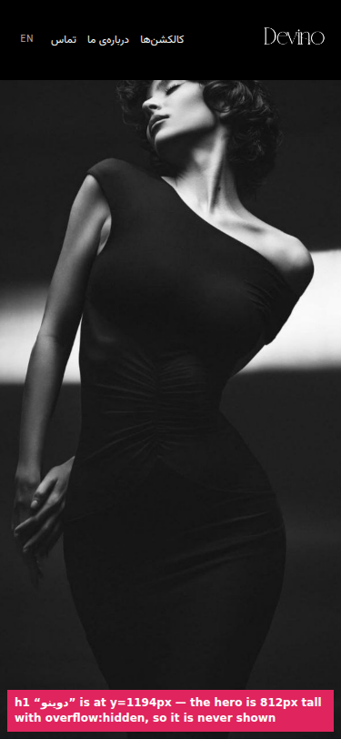
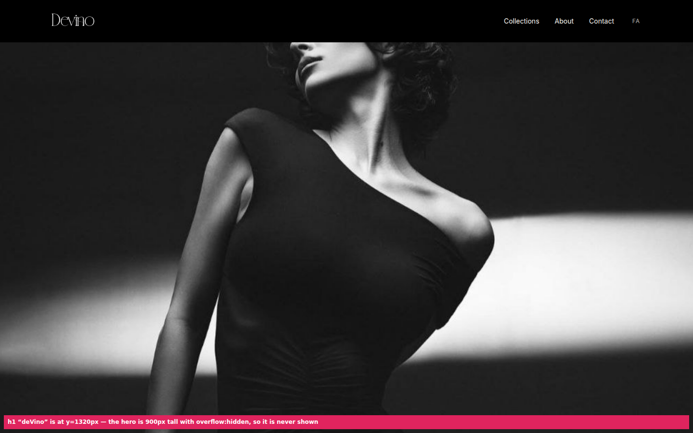

### ۲. هدر روی بالای عکس هیرو می‌افتد و صورت مدل زیر آن پنهان می‌شود
**صفحه‌ی اصلی · دسکتاپ (در موبایل کمتر)**

- هیرو از y=0 شروع می‌شود و هدر ثابت ۸۸ پیکسلی روی آن است.
- با نقطه‌ی فوکوس فعلی (۱۸٪ از بالا)، چشم‌ها و پیشانی مدل در دسکتاپ پشت نوار مشکی هدر می‌روند.
- در تصویر پایین، هدر برای نمایش موقتاً نیمه‌شفاف شده است.
- صفحه‌ی `/collections` این مشکل را ندارد، چون پوسترش از زیر هدر شروع می‌شود.

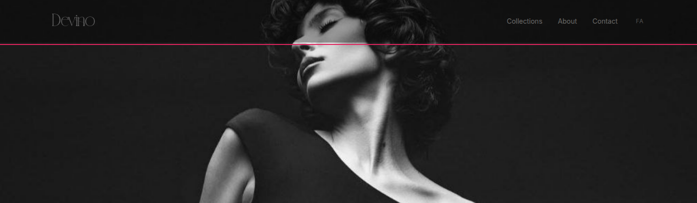

### ۳. لینک‌های منوی هدر در موبایل برای لمس خیلی کوچک‌اند
**همه‌ی صفحه‌ها · هر دو زبان · موبایل**

- «کالکشن‌ها»، «درباره‌ی ما» و «تماس» فقط ۱۶ پیکسل ارتفاع دارند. حداقل استاندارد ۴۴ پیکسل است.
- لینک لوگو ۷۱×۳۳ پیکسل است.
- «تماس» در فارسی فقط ۲۸ پیکسل عرض دارد.
- لینک‌ها به هم نزدیک‌اند و احتمال لمس اشتباه زیاد است.
- دکمه‌ی تغییر زبان (EN/FA) درست است (۴۴×۴۴).

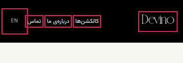
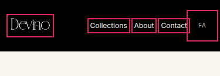

---

## 🟠 مهم (قابل‌استفاده، ولی بهتر است قبل از انتشار اصلاح شود)

### ۴. «تماس تلفنی» / "Call" شماره را نشان نمی‌دهد
**`/contact` · هر دو زبان · مخصوصاً دسکتاپ**

- لینک از نوع `tel:` است ولی شماره هیچ‌جا نوشته نشده.
- روی دسکتاپ کلیک روی آن معمولاً کاری نمی‌کند. بازدیدکننده راهی برای دیدن شماره ندارد.

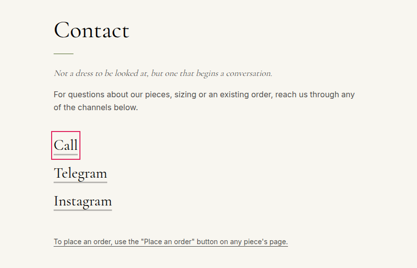
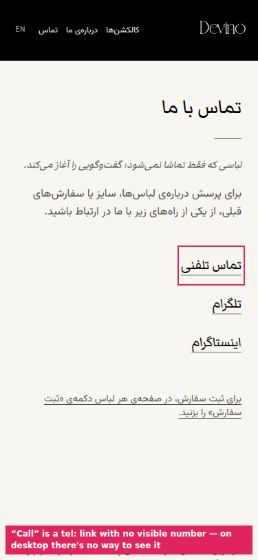

### ۵. فلش‌های کاروسل ۴۰×۴۰ هستند و شمارنده ندارند
**`/collections` و `/collections/[slug]` · هر دو زبان · موبایل**

- اندازه‌ی فلش‌ها کمی کمتر از حداقل ۴۴ پیکسل است.
- هیچ نشانه‌ای (نقطه یا «۱ از ۵») نشان نمی‌دهد چند لباس یا کالکشن وجود دارد. مثلاً «غروب شراب» ۵ لباس دارد.

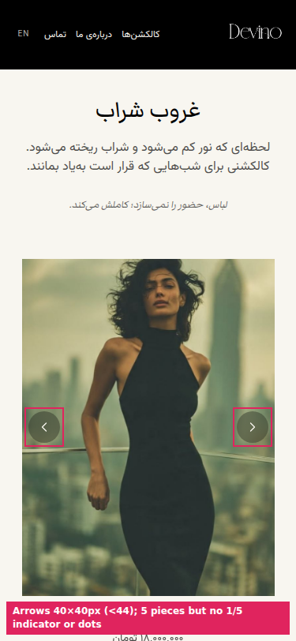

### ۶. خطاهای فرم سفارش خیلی کم‌رنگ دیده می‌شوند
**`/order` · هر دو زبان · هر دو اندازه**

- در حالت خطا فقط کادر فیلد از خاکستری به مشکی تغییر می‌کند (شبیه حالت فوکوس)، به‌علاوه‌ی یک نقطه‌ی زیتونی خیلی کوچک کنار پیام.
- پیام‌ها خوانا هستند، ولی نگاه اول فیلدهای خطادار از فیلدهای درست تشخیص داده نمی‌شوند.
- با پالت سه‌رنگی برند (بدون قرمز) منطقی است، ولی کادر ضخیم‌تر یا علامتی کنار برچسب کمک می‌کند.

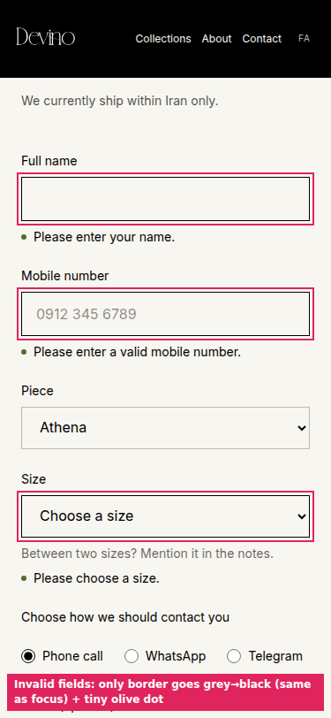

---

## 🟡 جزئیات ظاهری (polish)

### ۷. نقطه‌ی جداکننده‌ی فوتر در موبایل تنها می‌ماند
**همه‌ی صفحه‌ها · هر دو زبان · موبایل**

وقتی لینک «قوانین و حریم خصوصی» به خط بعد می‌رود، «·» تنها در انتهای خط اول باقی می‌ماند.

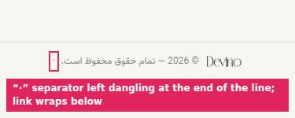
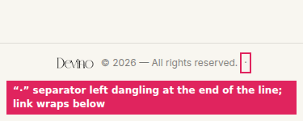

### ۸. متن فارسی به‌صورت ایتالیک (کج) نمایش داده می‌شود
**fa · همه‌ی اندازه‌ها**

- فونت‌های فارسی نسخه‌ی ایتالیک ندارند، پس مرورگر حروف را به‌صورت مصنوعی کج می‌کند. در خط فارسی این شکل ناپخته‌ای دارد.
- جاهایی که پیدا شد:
  - جمله‌ی زیر عنوان کالکشن («لباس، حضور را نمی‌سازد؛ کاملش می‌کند.»)
  - جمله‌ی پایانی صفحه‌ی اصلی
  - نقل‌قول پایان صفحه‌ی «درباره‌ی ما»
  - جمله‌ی زیر عنوان «تماس با ما»

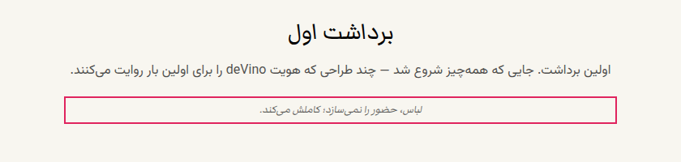

### ۹. عدد و جداکننده‌ی لاتین داخل صفحه‌های فارسی
**fa**

- **شماره‌ی لیست:** لیست مراحل در `/terms` با شماره‌های «1. 2. 3.» نمایش داده می‌شود، در حالی که متن همان صفحه از ۳۶ و ۴۰ فارسی استفاده می‌کند.
- **جداکننده‌ی قیمت:** قیمت‌ها به شکل «۲۷,۰۰۰,۰۰۰» هستند: ارقام فارسی با ویرگول لاتین. جداکننده‌ی فارسی «٬» است. این در صفحه‌ی محصول، کارت کالکشن و خلاصه‌ی فرم سفارش دیده می‌شود.
- **صفحه‌ی 404:** عدد «404» با ارقام و فونت لاتین نوشته شده است.

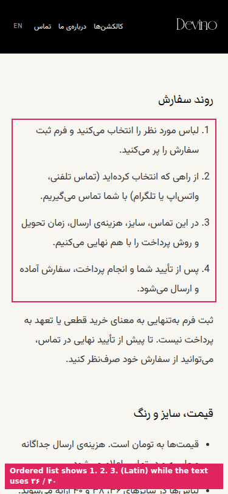
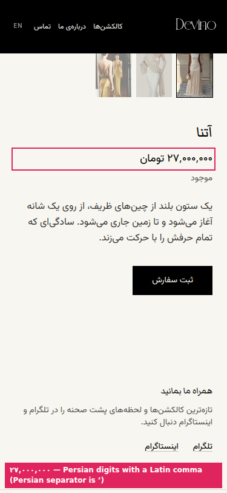
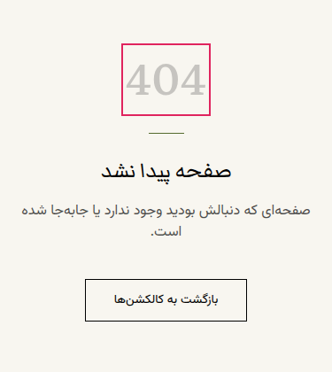

### ۱۰. کل جمله‌ی راهنمای سفارش در صفحه‌ی تماس یک لینک است
**`/contact` · هر دو زبان**

- جمله‌ی «برای ثبت سفارش، در صفحه‌ی هر لباس…» در دو خط زیرخط‌دار شده است.
- با سبک بقیه‌ی لینک‌های سایت، که کوتاه‌اند، هم‌خوان نیست.

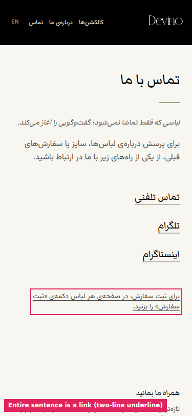

### ۱۱. کلمه‌ی تنها در خط آخر
- **en · موبایل:** شعار صفحه‌ی اصلی به شکل "A Presence of Her / Own." می‌شکند.
- **fa · موبایل:** توضیح کالکشن «برداشت اول» با «می‌کنند.» تنها در خط آخر تمام می‌شود.

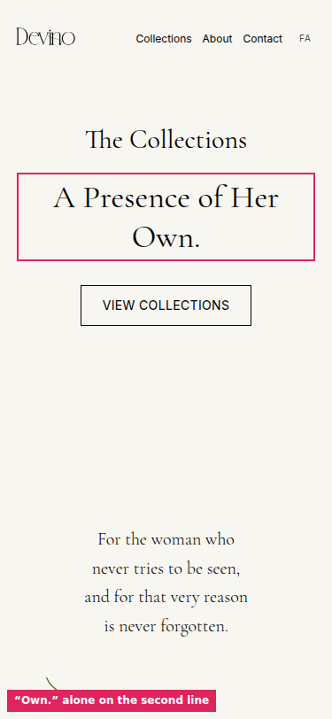

### ۱۲. فاصله‌های خالی طولانی در صفحه‌ی اصلی
**هر دو زبان · بیشتر در دسکتاپ**

- بین دکمه‌ی «مشاهده‌ی کالکشن‌ها» و جمله‌ی بخش صدفی حدود ۲۵۰ پیکسل فضای خالی است.
- بین خط شانه و جمله‌ی پایانی هم حدود ۲۵۰ پیکسل فضای خالی است.
- اگر این فاصله‌ها عمدی (برای حس «نفس کشیدن») نیستند، کمی زیاد به نظر می‌رسند.

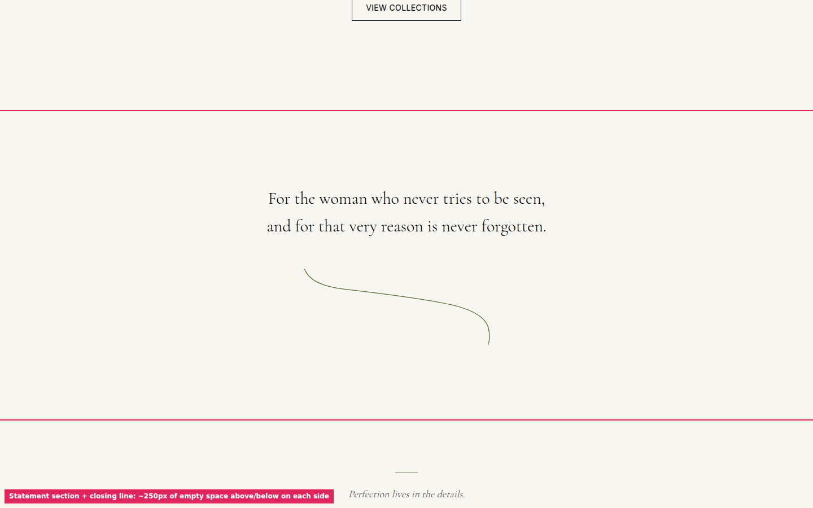

---

## ✅ ترکیب‌های بدون مشکل

(به‌جز موارد مشترک بالا: هدر موبایل، فوتر و ایتالیک فارسی)

| صفحه | وضعیت |
|---|---|
| `/about` | تمیز در هر ۴ حالت |
| `/terms` en | تمیز. fa فقط مورد ۹ |
| `/products/athena` | تمیز، به‌جز جداکننده‌ی قیمت fa. گالری بندانگشتی در RTL درست چیده شده |
| `/collections` | پوستر، گرادیان و دکمه درست هستند. فقط مورد ۵ |
| `/order` حالت عادی و «تلگرام» | فیلد نام کاربری تلگرام درست ظاهر می‌شود. چیدمان RTL (فلش select، placeholder شماره) درست است |
| پیام موفقیت سفارش | تمیز در هر دو زبان |
| 404 en | تمیز. fa فقط مورد ۹ |

هیچ صفحه‌ای اسکرول افقی، هم‌پوشانی عناصر، عکس کشیده‌شده یا رنگ خارج از پالت ندارد. کنتراست متن‌ها در همه‌جا کافی است.

## فایل‌ها

- `‎<page>-<fa|en>-<mobile|desktop>.png`: ۳۶ اسکرین‌شات اصلی.
- `order-errors-*` و `order-telegram-*`: حالت خطا و انتخاب تلگرام در فرم سفارش (۴ حالت).
- `order-success-*`: پیام موفقیت سفارش (۴ حالت).
- `issues/`: برش‌های علامت‌گذاری‌شده‌ی هر مورد.
- `audit.json`: خروجی بررسی خودکار. شامل اندازه‌ی دقیق هر هدف لمسی کوچک است.
